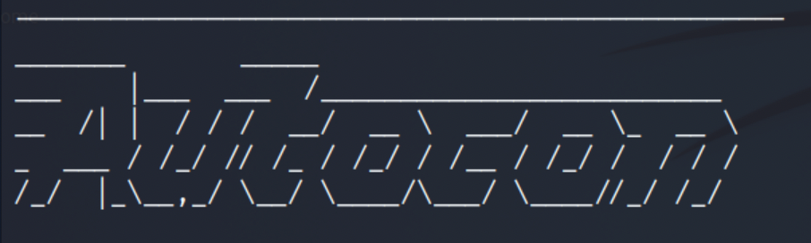

# Autocon

    

        <a href="https://github.com/JAML2106/Autocon" rel="noopener">
            </img>
        </a>
    

<h3 align="center"><a href="https://github.com/JAML2106/Autocon">AUTOCON</a></h3>

---

    Auto reconnaissance tool.

## About

 Autocon is an automated recon tool. Our interface allows the user to do a wide variety of investigations to ensure a solid foundation for any suspicious activity. 

## Built Using

-Bash
-Tshark
-Nmap

## Authors

[John Parsons, Logan Smith, Matthew Hogan and Annette Figueroa]
